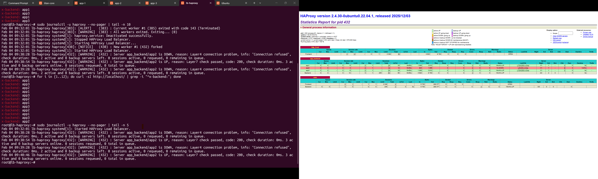

# Homelab AWS-Style Load Balancing Architecture

This project simulates an **AWS-style application architecture** using a Proxmox-based homelab.

The primary goal of this project is to **observe and understand how a load balancer behaves**
when distributing traffic across multiple application nodes, including:

- Round-robin traffic distribution
- Health checks
- Automatic failover
- Traffic redistribution when a node goes down

During implementation, several infrastructure constraints were encountered while deploying
Docker inside LXC containers. These challenges became an additional learning outcome and
reflect how real systems often require engineers to adapt designs during deployment.

This project was intentionally built on **limited hardware (4GB RAM, 64GB storage)** to
mirror realistic resource constraints in small environments.

---

## Architecture Overview

This homelab mirrors a simplified AWS-style layout:

- **HAProxy**  
  Acts as an Application Load Balancer (ALB)

- **Application Nodes (app1, app2, app3)**  
  Simulate EC2 instances running containerised web services

- **PostgreSQL**  
  Simulates an RDS-style backend database

- **Proxmox LXC**  
  Lightweight compute layer for all nodes

The design focuses on **behaviour, observability, and resilience**, rather than cloud-specific tooling.

---

## Project Scope

### Primary Objective
- Understand and verify **load balancer behaviour**
- Observe how traffic is distributed across healthy nodes
- Confirm automatic failover when a backend becomes unavailable

### Secondary Learning Outcomes
- Running Docker inside LXC under resource and kernel constraints
- Adapting container storage and security configurations
- Understanding how infrastructure differences affect deployment, but not service behaviour

---

## Prerequisites
- Proxmox VE with LXC support
- SSH access between nodes
- Docker installed inside application containers
- Git

---

## Application Nodes

Each application node serves the same purpose and exposes a web service on port `3000`.

| Node | Role | Port |
|------|------|------|
| app1 | Application Server | 3000 |
| app2 | Application Server | 3000 |
| app3 | Application Server | 3000 |

All application nodes are treated equally by the load balancer.


---

## Load Balancing with HAProxy
HAProxy is configured to:

- Use **round-robin** load balancing
- Perform **HTTP health checks**
- Automatically remove unhealthy nodes
- Reintroduce nodes when they recover

TTo make traffic flow observable, HAProxy injects a custom response header:

```text
X-Backend: app1
X-Backend: app2
X-Backend: app3

```
This allows clear identification of which backend handled each request.


## Load Balancing Verification
This section verifies that HAProxy distributes traffic evenly across
all application nodes using a round-robin strategy.

---


### Round-Robin Test With Dashboard

The test below sends multiple HTTP requests to the load balancer and inspects which backend server handled each request.

```bash
for i in {1..12}; do
  curl -sI http://localhost/ | grep -i "^x-backend:"
done
```
The output should rotate between all application nodes.


----

## Network Isolation & Firewall Enforcement
To better simulate a real-world architecture, **direct access to backend
application nodes is restricted**.

Only the load balancer is allowed to communicate with application services.

### Access Model
- Application services listen on port `3000`
- Only HAProxy can reach backend nodes
- Direct access from the Proxmox host or other nodes is blocked
- Backend nodes behave like instances in a **private subnet**

### Docker-Aware Firewall Rules
Because Docker-published ports can bypass traditional host firewalls,
access control is enforced using the `DOCKER-USER` chain.

The following rule pattern is applied on each application node:

```bash
# Allow traffic from HAProxy only (match original destination port)
iptables -I DOCKER-USER 1 -p tcp -m conntrack --ctstate NEW --ctorigdstport 3000 -s <LB_IP> -j ACCEPT

# Drop all other access
iptables -I DOCKER-USER 2 -p tcp -m conntrack --ctstate NEW --ctorigdstport 3000 -j DROP

```


## Database Layer (PostgreSQL)

A PostgreSQL instance is used to simulate an RDS-style backend database.

- Database access is restricted using `pg_hba.conf`
- Only application nodes are allowed to connect
- Network-level access control is enforced
- Database deployment is decoupled from application containers

This separation reflects real-world backend design principles.

----

## Design Decisions & Constraints

### Why LXC (instead of full virtual machines)

LXC was chosen over full virtual machines to operate within limited
homelab resources:

- Lower CPU and memory overhead
- Faster provisioning and recovery
- Suitable for a 4GB RAM / 64GB storage environment

LXC provides a lightweight yet practical way to simulate EC2-style
instances in a constrained setup.

----

### Running Docker inside LXC

Docker is intentionally run inside **privileged LXC containers**.

During deployment, several constraints were encountered, including:
- AppArmor restrictions
- Overlay filesystem limitations
- Kernel feature availability differences

These constraints required practical adjustments such as:
- Security profile tuning
- Alternative storage drivers (e.g. `fuse-overlayfs`)

These challenges closely resemble real-world operational scenarios.

----

### Why application nodes are not identical

Although all application nodes serve the same workload, their internal
Docker configurations are not identical:

- `app1` runs Docker using the default overlay filesystem
- `app2` and `app3` require `fuse-overlayfs` due to environment constraints

This difference is intentional.

In real production environments, infrastructure is rarely uniform.
Load balancers operate based on **health and availability**, not internal
implementation details.

HAProxy treats all nodes equally as long as service contracts are met.

----

## Lessons Learned

- Load balancers distribute traffic based on health, not implementation
- Infrastructure constraints are a normal part of real deployments
- Observability is essential for understanding system behaviour
- Reliable systems are designed to tolerate differences between nodes

----

## Summary

This project demonstrates a practical, operations-focused approach to:

- Load balancing and failover behaviour
- Containerised applications under constraints
- Health checks and traffic redistribution
- Infrastructure decision-making on limited hardware

The emphasis of this project is on **understanding how systems behave**,
not on building a perfect or idealised environment.
